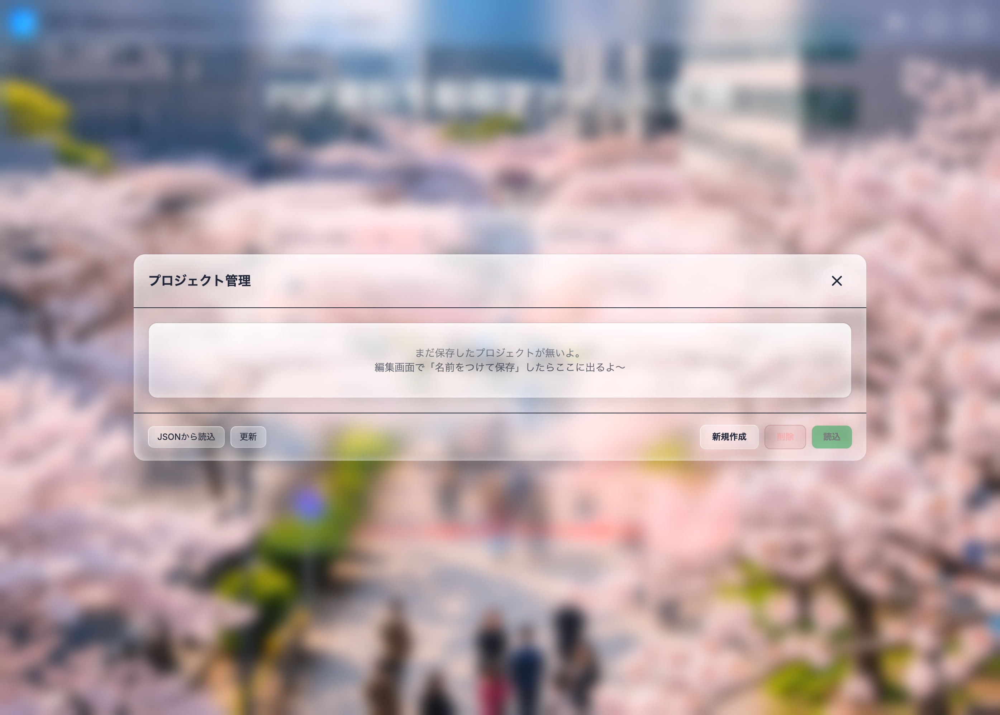

# PDF Slideshow Maker ユーザーマニュアル（小学生でもわかる版）

このアプリは、**PDFを動画（スライドショー）にする**ためのアプリだよ。
スライドに文字や画像をのせたり、音声やBGMもつけられるよ。

---

## 目次（どこに何が書いてある？）

- まず大事なこと（安全とAI）
- 起動画面（PDFを入れる）
- プロジェクト管理（保存/読込/削除）
- ガラス設定（背景の見た目）
- 編集画面（スライド/タイムライン/右パネル）
- スライド編集（トリミング/装飾/画像/音声）
- 全画面プレビュー
- 書き出し（動画作成とダウンロード）
- JSON / APIキー / 困ったとき

## まず大事なこと（超たいせつ）

- **PDFや画像や音声は、このアプリのサーバーには送らない**よ（だいたいブラウザの中で動くよ）。
- でも、**AIを使うときだけ**は、文章やスライド画像などを **Google（Gemini API）に送って処理**するよ。
  - だから、秘密の内容はAIに送らないほうが安全だよ。
- APIキーは、**パスワードみたいなもの**だよ。人に教えないでね。

---

## 画面の見かた（どこに何がある？）

だいたい、こういう形だよ。

- **上のバー（ヘッダー）**：利用リンク、ガラス設定、APIキー、保存の状態、Dev Mode
- **スライド一覧（カード）**：スライドを選ぶ、並び替える、削除/複製する
- **下のタイムライン**：時間の流れ（再生バー）、スライドの長さや順番をいじる
- **右のパネル（設定）**：
  - スライドを選んでないとき → **プロジェクト設定**
  - スライドを選んだとき → **スライド編集**

---

## 起動画面（最初にやること）

### 1) PDFをアップロード（まずこれ）
1. 「PDFファイルをアップロード」を押す（またはドラッグ＆ドロップ）
2. PDFを選ぶ

### 2) 前の作業を開く（ある人だけ）
- アップロードの下にある **フォルダの丸ボタン** を押すよ（プロジェクト管理）
- そこから、昔の作業を開けるよ

### 3) こだわり設定（あとでOK）
- アップロードの下にある **つまみの丸ボタン** を押すよ（こだわり設定）
- ここで変えられるよ
  - **基本表示時間**：1枚のスライドを何秒見せるか
  - **切り替え効果**：スライドが切り替わるときの動き（フェードなど）
  - **AIでナレーション原稿を自動生成**（ベータ）
    - これは **AIが使える状態（connected）** のときだけONにできるよ
    - ONにすると、PDFを読む時間が少し長くなることがあるよ

### スマホの注意
- スマホは **縦向き**で使ってね（横向きだと使えないよって画面が出るよ）

---

## プロジェクト管理（保存/読み込み/削除）

「プロジェクト管理」は、**このブラウザの中に保存した作業**をまとめて見れる画面だよ。

### 開き方
- 起動画面：アップロードの下にある **フォルダの丸ボタン**
- 編集画面：上の「プロジェクト管理」

### できること
- **読込（開く）**
  - 一覧で選んで「読込」ボタン
  - または **サムネをダブルクリック**
- **更新**
  - 一覧を読み直すよ（増えたり減ったりした時に便利）
- **新規作成**
  - プロジェクト管理を閉じて、まっさらで始めるよ
- **削除**
  - 1つ選んでから「削除」（戻せないよ）
- **JSONから読込**
  - 以前「保存（JSON）」したファイルを読み込んで、続きから編集できるよ

### 注意
- プロジェクトは **ブラウザの中に保存**されるよ。
- ブラウザの「サイトデータ削除」みたいなのをすると、消えることがあるよ。
  - 大事なら **JSON保存**もしておくと安心だよ。

---

## ガラス設定（背景の見た目）

ヘッダーの「ガラス設定」ボタンで、背景の見た目を変えられるよ。

### できること
- **背景**：デフォルト / 色 / 画像
- **画像モード**（画像を選んだとき）
  - 自由（ドラッグして位置を変えられる）
  - 画面フィット（画像がぜんぶ見える）
  - タイル（同じ画像をくり返す）
- **ガラス**：ガラスの色、透明度（うすさ）、ぼかし（ブラー）

### ポイント
- 変えたら **すぐ反映** されるよ
- これは **この端末だけに保存** されるよ（別のPC/スマホでは別になるよ）
- 迷ったら「リセット」や「デフォルトに戻す」でOKだよ

## 編集画面（メイン）

### 上のボタン（編集画面の一番上）
- **読込**：JSONのプロジェクトを読み込む
- **保存**：JSONで書き出す（バックアップや別PC移動用）
- **名前をつけて保存**：プロジェクト管理に保存する（複数持てる）
- **プロジェクト管理**：保存した一覧を開く
- **元に戻す / やり直し**：Ctrl+Z / Ctrl+Y（または Ctrl+Shift+Z）
- **全画面プレビュー**：動画みたいに再生して確認する
- **書き出し**：MP4/MOV を作る（終わったら「動画ダウンロード」で保存するよ）
- **設定を開く/閉じる（≡）**：右の設定パネルを開いたり閉じたり
- **Dev Mode**（スイッチ）
  - ONにすると、APIの状態（connected など）や、使った量っぽい情報が出るよ（ふだんはOFFでOK）

---

## スライド追加（「スライド追加」）

好きな場所にスライドを足せるよ。

- **No.◯ の 前/後 に追加**：入れたい場所を決める
- **画像**：画像ファイルからスライドを追加
- **無地**：色だけのスライドを追加（暗転/休憩スライドに便利）

---

## 一括設定（全スライド適用）

「全部まとめて同じにしたい！」ときに使うよ。

- 全スライドの **表示時間** をそろえる
- 全スライドの **音量** をそろえる
- 全スライドの **切り替え効果** をそろえる
- **ナレーション（Slide Audio）をまとめてずらす**（例：+1.5秒）
  - 音声があるスライドだけが対象だよ
  - 0秒より左には行かないよ（マイナスでずらしても0で止まるよ）
  - 「時間を伸ばす」をONにすると、ずらした分だけ **スライドの表示時間も伸ばす** よ

---

## スライド一覧（カードのところ）

スライド1枚ずつに、こういう操作ができるよ。

- **クリック**：そのスライドを選ぶ（右の「スライド編集」が出る）
- **もう一回クリック**：選択を外す（右が「プロジェクト設定」に戻る）
- **ドラッグ**：順番を入れ替え
- **⤓（画像を保存）**：そのスライドの画像を **PNGで保存（高画質）** できるよ（カード右上に出るよ）
- **♫**：そのスライドに音声があるマークだよ
- **切り替え効果**：カード下のラベルを押して選ぶ
- **時間（秒）**：カード下の数字を変える
- **複製**：同じスライドをもう1枚作る
- **削除**：消す（戻せないことがあるから注意）

---

## タイムライン（下の時間のやつ）

ここは「動画の時間」をいじる場所だよ。

- 赤い線：いま見てる時間（再生位置）
  - クリック/ドラッグで動かせるよ（動かしてる間、ちっちゃいプレビューが出るよ）
- Zoom：大きくすると細かく見れるよ（小さくすると全体が見れるよ）
- スライドのかたまり
  - ドラッグで順番を入れ替え
  - 端っこをドラッグで「秒数（長さ）」を変えられるよ
- 切り替えの長さ（ふわっとする時間）
  - スライドの **右はし** に、色つきのしましま（Fとか）が出るよ
  - その **しましまの左はし** の細い棒を左右にドラッグすると、切り替えが **長く/短く** なるよ
- 音声がある時
  - スライドの音声やBGMが見えるよ（ずらしたり、長さを合わせたりできるよ）

※ タイムラインでいじったことも、最後はちゃんと画面を見て確認してね。

---

## 右のパネル：プロジェクト設定（スライド未選択のとき）

### 動画出力
- **フォーマット**：MP4 / MOV
- **アスペクト比**：16:9 / 4:3 / 1:1 / 9:16
- **解像度**：1080p / 720p
- **背景処理**
  - 黒帯 / 白帯 / 画像
  - 「画像」を選ぶと、背景画像を選べるよ

### 書き出しと保存（ダウンロード）
- 上の「書き出し」で動画を作るよ
- 終わったら「動画ダウンロード」で保存できるよ
  - 保存場所は、だいたい **ブラウザのダウンロード先** だよ（ブラウザの設定で変わるよ）
  - ファイル名は `slideshow.mp4` / `slideshow.mov` になるよ（あとで名前を変えてOK）
- ブラウザによっては書き出しできないことがあるよ（その時は **Chrome / Edge** がおすすめ）

### 見た目
- **スライド縮小**：スライドを少し小さくして背景を見せる量
- **角丸半径**：スライドの角を丸くする
- **標準切替時間**：切り替えの長さ（例：0.5秒）

### BGM & オーディオ
- **BGM**
  - 追加/削除
  - 波の絵（波形）で、流す範囲と音量を調整できるよ
  - Fade In / Fade Out（BGMの最初/最後をふわっと）
  - 「スライドを曲の長さに合わせる」：曲の長さに合わせて1枚の秒数を自動でそろえる
- **自動音量調整（Ducking）**
  - ナレーション中だけBGMを小さくするやつだよ
- **全体ナレーション**
  - 動画ぜんぶにかぶせる音声（1本）を入れられるよ

---

## 右のパネル：スライド編集（スライド選択中）

### まず大事：プレビューはすぐ変わるけど、保存は「適用」だよ
- インスペクターでいじった内容は、右のプレビューには **すぐ出る** よ
- でも **「適用」** を押すまで、編集内容は **ほんとには反映されない** よ（一覧/全体プレビュー/書き出しは前のまま）
- **「適用」してない編集** は、スライドを切り替えたり右パネルを閉じたら **消える** よ（ごめん！）
- **「適用」した内容** は、上の「元に戻す（Undo）」で戻せるよ

### 「適用」ボタンってなに？
- 右上の **「適用」** は、いまの編集内容を **スライドに反映（保存）** するボタンだよ
- 押すと、**スライド一覧のサムネ（小さい見本画像）も作り直す** よ（更新中はボタンが止まるよ）

### プレビュー（上の絵のところ）
- **スライド（白っぽい枠）** と **背景（黒っぽい所）** があるよ
- スライドは **移動** と **大きさ変更** ができるよ（回転はしないよ）
- オブジェクト（文字/画像/装飾）は
  - クリックで選択
  - ドラッグで移動
  - 四角いハンドルで大きさ変更
  - くるっとマークで回転（オブジェクトだけ）

### 要素一覧（レイヤー）
ここ、めっちゃ便利だよ。

- クリックで選択できる
- 「非表示」：見えなくする
- 「ロック」：動かないようにする（ミス防止）
- **ドラッグで並び替え（上ほど手前）**
  - 上のほうにある物ほど、前（手前）に見えるよ
- `SLD` はスライド本体だよ
  - `SLD` より上に置くと「スライドより前」
  - `SLD` より下に置くと「スライドの後ろ」

### キーボード操作（選択してる時）
- **Delete / Backspace**：選んでるオブジェクトを削除（ロック中は消えない）
- **矢印キー**：ちょっとずつ動かす
  - **Shift + 矢印**：大きく動かす
- **Esc**：追加しようとしてる状態をやめる

### プレビューの「最大化」
- 右上の **「最大化」** を押すと、プレビューだけを **別窓みたいに大きく** 出せるよ
- 「戻す」を押すと、元の場所に戻るよ

---

## タブ：トリミング（表示範囲）

- スライドの「見せたいところ」を決めるよ
- 枠をドラッグして調整してね
- **ガイド線**：枠の中に線を出したり消したりできるよ（だいたい目安）
- **比率**：デフォルト / 16:9 / 4:3 / 1:1 / 9:16 / フリー を選べるよ
- 「範囲リセット」で元に戻せるよ

※ トリミング中は、スライドやオブジェクトの移動とは役割がちがうよ。

---

## タブ：装飾（テキスト/線/矢印/四角/丸）

### 追加
- 「テキスト / 線 / 矢印 / 四角 / 丸」を押す
- 画面に「ダブルクリックして配置」って出たら、**置きたい所をダブルクリック**してね

### できること
- 色、太さ、透明度
- ふち（アウトライン）
- 影（シャドウ）
- 回転
- 反転（左右/上下）
- アニメーション（入/アウト）
- **開始時間**（いつから出すか）と **長さ**（いつまで出すか）

---

## タブ：画像（アップロード / AIで生成）

### 追加（アップロード）
- 「ファイルを選択」から画像を選ぶよ

### 追加（AIで生成）
- 「AIで生成」は **APIが connected の時だけ**使えるよ
- 文章（プロンプト）を入れて「画像を生成」

### できること
- 透明度
- 反転（左右/上下）
- アニメーション（入/アウト）
- 影（ドロップシャドウ）
- 回転
- レイヤー順（前/後）

---

## タブ：音声（アップロード / 録音 / AI読み上げ）

### アップロード
- 音声ファイルを選んで、そのスライドに付けるよ
- 音量も変えられるよ

### 録音
- マイクを使って録音できるよ
- さいしょに「マイク使っていい？」って聞かれたら **許可**してね

### AI読み上げ（Gemini）
- これは **APIが connected の時だけ**使えるよ
- できること
  - スライド画像から原稿を作る（指示文も書ける）
  - 原稿を読み上げ音声にする（声の種類も選べる）

---

## 全画面プレビュー（再生チェック）

- 「全画面プレビュー」で動画みたいに再生できるよ
- 再生バー（シークバー）を動かして、好きなところから見れるよ

※ 重いときは、他のタブを閉じたり、解像度を下げるとラクになることがあるよ。

---

## 書き出し（MP4/MOVを作る）

### 事前にやること
- 右の「プロジェクト設定」で
  - フォーマット（MP4/MOV）
  - アスペクト比
  - 解像度
  - 背景処理（黒帯/白帯/画像）
を決めてね。

- 音を入れたいときは、BGM / 全体ナレーション / 各スライドの音声 を先に入れてね

※ もし「書き出し」を押して **「このブラウザでは動画の書き出しができないよ」** みたいに出たら、対応ブラウザ（Chrome/Edgeなど）で開いてね。

### 書き出しのしかた
1. 上の「書き出し」を押す
2. しばらく待つ（スライドが多いほど時間かかるよ）
3. 終わったらプレビューが出るよ

※ 書き出し中は、できれば **タブを閉じない/PCをスリープしない** ほうが安全だよ。

### 終わった後（保存）
- **動画ダウンロード**：動画ファイルを保存するよ
- **画像ダウンロード**：動画の好きな時間の画像を保存できるよ（1枚 / ZIP）
- **再編集**：編集画面に戻るよ
- **最初から**：全部リセットするよ

#### 画像ダウンロードの中身
- **1枚**：好きな秒数を入れて画像を1枚ダウンロード
- **ZIP（最大20枚）**：時間の範囲を入れて、最大20枚までまとめてダウンロード

※ ダウンロードした動画がQuickTimeでうまく再生できない時は、VLC Playerやブラウザ再生を試してね。

---

## JSONってなに？（かんたん説明）

- JSON（ジェイソン）は、**設定が入ったメモみたいなファイル**だよ
- 「保存（JSON）」で書き出したら、他のPCに移したり、バックアップにできるよ

### 注意（サイズ上限）
- JSONの読み込みは **最大100MB** までだよ
- 大きすぎると読み込めないよ（画像/音声が多いと大きくなりがち）
- それと、JSONの中の `version` が合わないと読めないよ（古い/新しい形式だと弾かれることがある）

---

## APIキー（AI機能）の保存先（かんたん説明）

APIキー画面で、保存先を選べるよ。

- **メモリのみ**：リロードやタブを閉じると消える（その場だけ）
- **このタブだけ**：同じタブのリロードはOK、タブを閉じると消える
- **この端末に保存**：次回も残る（同じ端末・同じブラウザだけ）

「パスフレーズで暗号化」をONにすると、保存したキーを暗号化できるよ（共有PCにおすすめ）。

### AIを使うときの注意（お金/ネット）
- AIは **ネットが必要**だよ
- Geminiは使い方によって **料金がかかることがある**よ（APIキーを作ったあなたの契約側のルールになるよ）

---

## よくあるつまずき（困ったらここ）

### AIが押せない
- まずヘッダーの「APIキー」を入れて、「保存して使う」を押してね
- 少し待つと、AIのボタン（AIで生成 / AI読み上げ など）が押せるようになるよ
- Dev Mode をONにすると、APIの状態が見えるよ（緑っぽいならだいたいOKだよ）

### 音声の録音ができない
- マイクの許可がOFFになってるかも
- ブラウザの設定で、このサイトのマイクをONにしてね

### オブジェクトが動かない / 消せない
- 「要素一覧」で **ロック** になってないか見てね

### オブジェクトが見えない
- 「要素一覧」で **非表示** になってないか見てね
- レイヤー順で、スライドの後ろに行ってないかも見てね

### 書き出しができない（警告が出る）
- 「書き出し」を押して「このブラウザでは動画の書き出しができないよ」って出たら、対応ブラウザで開いてね（Chrome/Edgeなど）
- 「音あり動画ができないよ」って出たら、BGMや音声を外すか、別ブラウザで試してね

### 編集したのに、一覧のサムネ（カードの絵）が変わらない
- 右の「スライド編集」で **「適用」** を押してね（編集を保存＆サムネを作り直すよ）

### APIクールダウン中って出た
- AIをたくさん使った時に、一時的に待つやつだよ
- 0秒になるまで待ってね

---

## 自動保存と復元（とちゅうで消えても安心）

- このアプリは、作業を **自動で保存**してるよ（右上に「保存中…」「保存済み」って出ることがあるよ）
- もし途中でタブを閉じちゃったり、落ちちゃっても、
  次に開いたとき「作業の続きから始めますか？」って出たら
  - **復元する**：続きから再開
  - **破棄して新規作成**：前の作業は捨てて最初から
  を選べるよ

---

## よくある質問（FAQ）

### Q. APIキーを入れないと、何もできない？
A. そんなことないよ。PDFを読み込んで編集して書き出すのはできるよ。  
ただし **AIのボタンだけ** は `connected` の時しか使えないよ。

### Q. プロジェクトを別のPCに持っていける？
A. 「保存（JSON）」で書き出して、そのJSONを別PCで「読込」すればOKだよ。  
でも、画像や音声が多いとJSONが大きくなって（最大100MB）読み込めないことがあるよ。

### Q. 画像やBGMって何でも使っていいの？
A. なんでもOKじゃないよ。**自分が使っていい物（権利がある物）** を使ってね。
